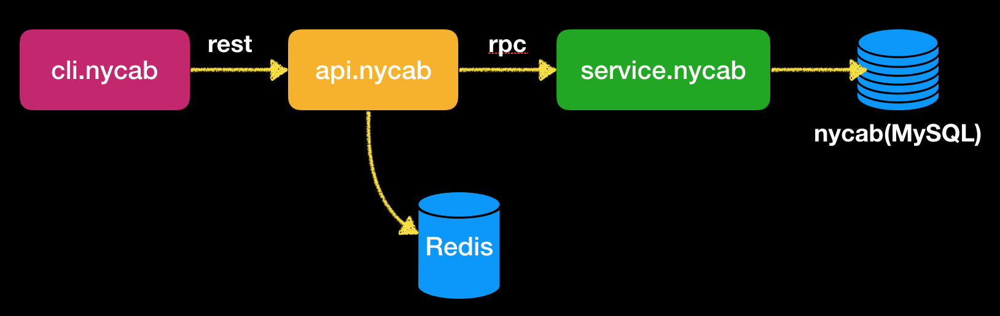

NYCAB Challenge
---
# Summary
Cab Data Researcher is a company that provides insights on the open data about NY cab trips. Cab trips in NY are public available as csv downloadable files. In order to make it more useful we want to wrap the data in a public API.

Data format is as follows:
```
medallion, hack_license, vendor_id, rate_code, store_and_fwd_flag, pickup_datetime, dropoff_datetime, passenger_count, trip_time_in_secs, trip_distance
```
* The medallion is cab identification.
* The API should provide a way to query how many trips a particular cab (medallion) has made given a
particular pickup date ( using ​pickup_datetime​). Only consider the date and not the time.
* The API must receive one or more medallions and return how many trips each medallion has made. 
* Considering that the query creates a heavy load on the database, the results must be cached.
* The API must allow user to ask for fresh data, ignoring the cache. There must be also be a method to clear the cache.

# Primary feature
1. Support RESTful API with OpenAPI(Swagger).
2. Support Redis cache and in-process cache to accellerate fetching data.
3. API support enforce getting data from database(with refresh argument).
4. API support cache clean manually.
5. Support interactive command line tool to acess API service.
6. Support independent RPC service to provide access to database.

# Setup Environment
## Golang tools
You can find more information on https://golang.org/dl/
## MySQL server

Create a local mysql service using docker:
```sh
docker pull mysql 
docker run --name some-mysql -e MYSQL_ROOT_PASSWORD=mytest -p 3306:3306 -v $HOME/data/mysql:/var/lib/mysql -d mysql
```
Then it is time to import your sql file to database.
I use mysql workbench(https://www.mysql.com/products/workbench/) to connect local MySQL database and import data.

## Redis server(optional) 
Data cache to Redis is implemented by api.nycab service. But you still can choose whether to use Redis for caching accessed data. If you don't use Redis(by clearing Redis config in api.nycab.yaml or not install Redis locally), service will select in-memory cache instead.

Create a local redis service using docker:
```sh
docker run -p 6379:6379 -d redis
```

# About Infrastructure
This challenge implement 3 main components:  
1. cli.nycab (Commandline tool) 
2. api.nycab (Restful API service)
3. service.nycab (GRPC service)  

cli.nycab raises requests to api.nycab and retrieve json responses.  

api.nycab handles these requests and decides whether to get data from cache or original database.  

If cache data is needed, api.nycab will try to connect with a real cache service, which is either an in-process memory service or a Redis service.  

If database is needed, api.nycab will get data through service.nycab GRPC connection.

In general, API service have public IP address so it can be accessed by any client in the Internet. GRPC services and its related database stay in internal network for security reason.

Components and their relation can be seen below.  



# About project file structure
This project structure is according to Go project convention (https://github.com/golang-standards/project-layout). The detail of the project is given below.

|Files/Dir|Description|
|---|---|
|api/proto/model.proto<br>api/proto/service.proto|These 2 files define GRPC interface of service.nycab, other Go files in this directory are generated by prototool.|
|api/swagger/nycab.yaml|This file defines swagger Restful API interface.|
|api/swagger/handler|Go implementation of API interface.|
|api/swagger/mapper|Mapping data structures between restful definitions and protobuf definitions.|
|api/swagger/models<br>api/swagger/restapi|Go files generated from api/swagger/nycab.yaml by swagger tool|
|cmd/api.nycab<br>cmd/cli.nycab<br>cmd/service.nycab|Corresponding to components we have mentioned before. They are Go project main entrances.|
|config|Each component have a same-name configure file, which will be used at start of running.|
|pkg/api/api.go|Belongs api.nycab, provide client to get access to GRPC service.|
|pkg/cache|Belongs to api.nycab. Cache implementation, include Redis version(redis.go) and In-process version(mem.go)|
|pkg/cli|Belongs to cli.nycab. Commands parser(parser.go) and command arguments handler(cache.go, count.go, help.go, quit.go). |
|pkg/config|Belongs to all components. Support parsing config files in config folder.|
|pkg/db|Belongs to service.nycab. MySQL data accessing interface and implementation.|
|pkg/rpc|Belongs to service.nycab. RPC(protobuf) interfaces implementation.|
|test/api|RESTful api test script. In order to use them to test, you need to install VSCode and RestClient plugin.|
|Makefile|This file support:<br>1. Build the whole project binaries in 'out' folder('make build').<br>2. Generate Go API files from swagger yaml file or protobuf file('make gen-rest' and 'make gen-proto'). <br>3. Run each service or client('make run-service' and 'make run-api' and 'make run-cli').<br>4. Run Basic Unit Test('make test').|

# Run the whole stack
1. Change directory to the root of the project.
2. Start MySQL and Redis service.
3. Import sql file to database.
If you use local installed MySQL, use command below.
```
mysql -u username –-password=your_password database_name < file.sql 
```
or use MySQL workbench to import data.

4. Run each command in sequence in a seperate terminal
```
make run-service
make run-api
make run-cli
```
# cli.nycab Command line help
```sh
> help
count
        Description:    count medallions pickup in a day 
        Example:        count medallion=medallion1,medallion2,medallion... date=2013-01-12 refresh=true
cache
        Description:    remove all cache
        Example:        cache clean
quit
        Description:    quit current application
        Example:        quit
```

# RESTful API request and response format
The description of this part can be seen through api/swagger/nycab.yaml.   
This yaml file is well documented and easy to view.  
A better way to view this document is to use swagger editor(https://editor.swagger.io/).  
You can import nycab.yaml to this website.  
The visualization of this yaml file will help you understand all the APIs and their request and response.

# Run Basic test
```sh
make test
```